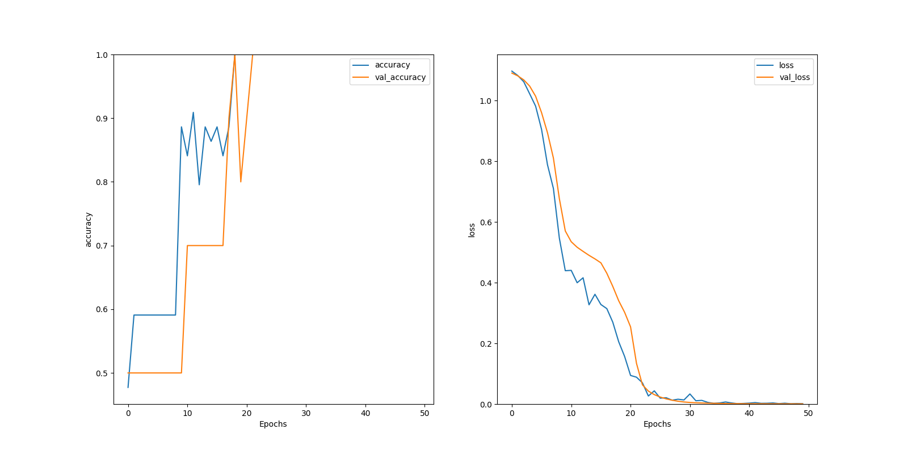

# Language-Detector-2
 Remaking the language detector with Tensorflow RNN technology. This uses a variety of sources for training data, including various songs (esp. Billy Joel) and the Aeneid (for Latin). Currently, there is some training and testing data for English, Spanish, and Latin, spread across more than 50 distinct text files.

## Summary of Results

 Running `neuralNet.py` will create, train, and evaluate a recurrent neural network for identifying the written language used in a sample of text. The output includes a set of `matplotlib` diagrams representing the accuracy and loss of the model as it is trained, as in the example shown below.

 

 The red horizontal line represents the baseline accuracy of a model that guesses language by random chance, for the sake of comparison. An example where the model achieved perfect matches with all training and testing data within 50 epochs is pictured below:

 

 The first image used a learning rate of `1e-4`, whereas the second used a learning rate of `1e-3`.

## Analysis

 The [original version](https://github.com/StardustGogeta/Language-Detector) looked at the frequency of certain letters and letter groups in words, working off the ansatz that the words of a language tend to share these characteristics. This version with Tensorflow looks instead at words as units and tries to guess the language from that. Comparing the results, it seems that the original may be slightly better at guessing language, and drastically so when words appear that are not present in the training data for the model. (This makes sense due to the functional limitations of the design.)
 
 However, this RNN approach offers a variety of other avenues to explore. As the page [here](https://www.tensorflow.org/tutorials/text/text_classification_rnn) (linked to in `neuralNet.py`) explains, this can be easily converted to sentiment analysis by dividing the dataset by sentiment rather than by written language. If we wanted, it would even be possible to attempt a program that predicts whether a particular song was written by Billy Joel!
