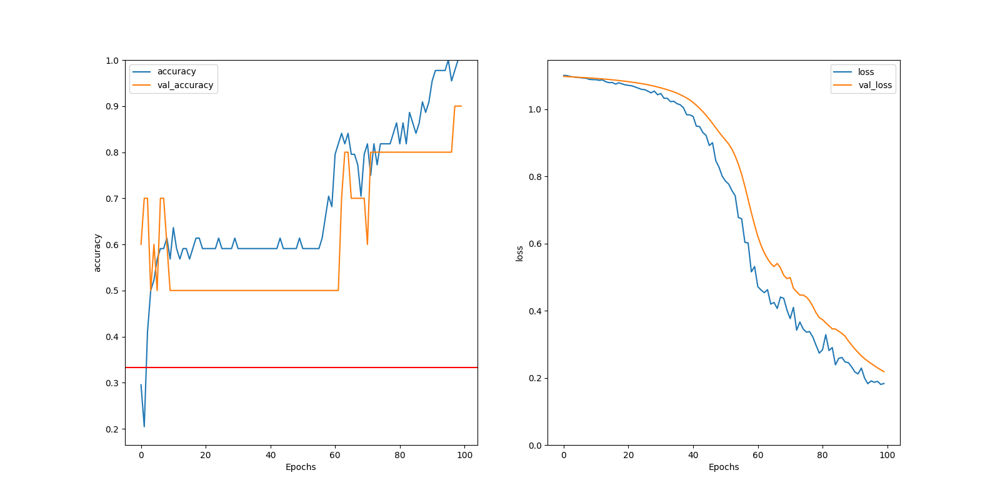

# Language-Detector-2
 Remaking the language detector with Tensorflow RNN technology. This uses a variety of sources for training data, including various songs (esp. Billy Joel) and the Aeneid (for Latin). Currently, there is some training and testing data for English, Spanish, and Latin.

 Running `neuralNet.py` will create, train, and evaluate a recurrent neural network for identifying the written language used in a sample of text. The output includes a set of matplotlib diagrams representing the accuracy and loss of the model as it is trained, as in the example shown below.

 

 The red horizontal line represents the baseline accuracy of a model that guesses language by random chance, for the sake of comparison.
